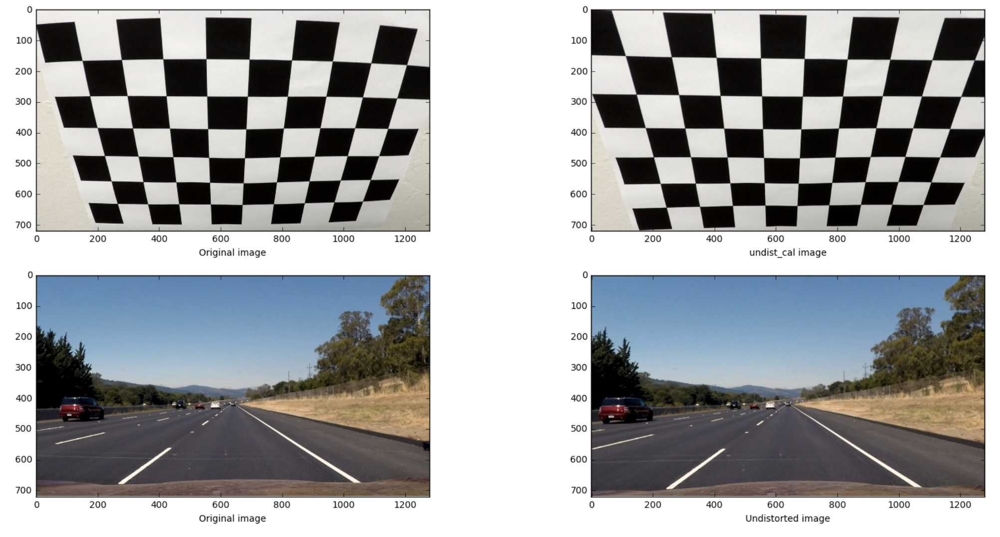
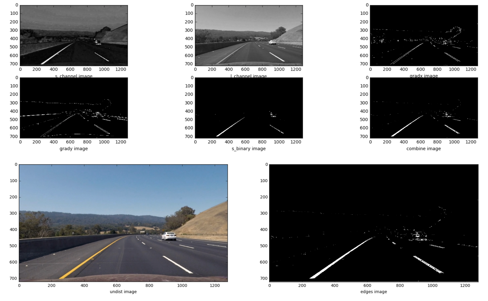
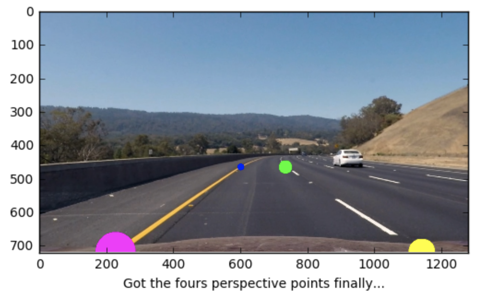
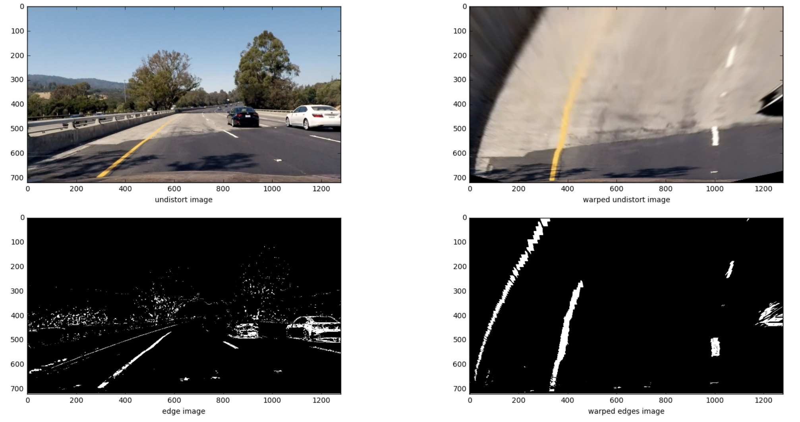
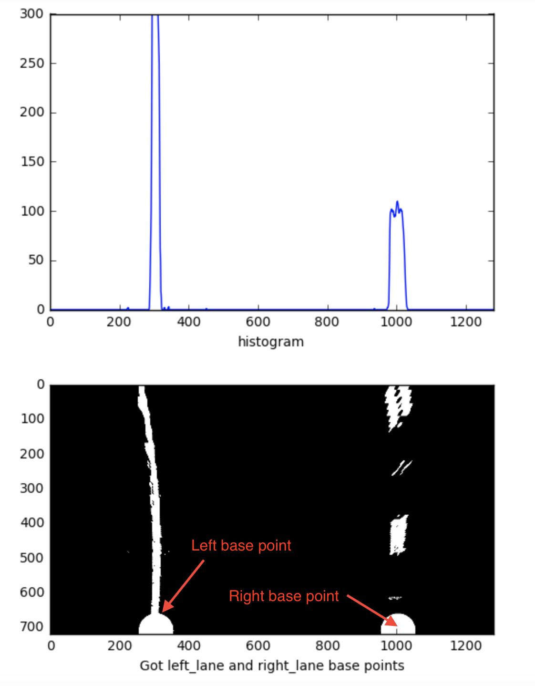
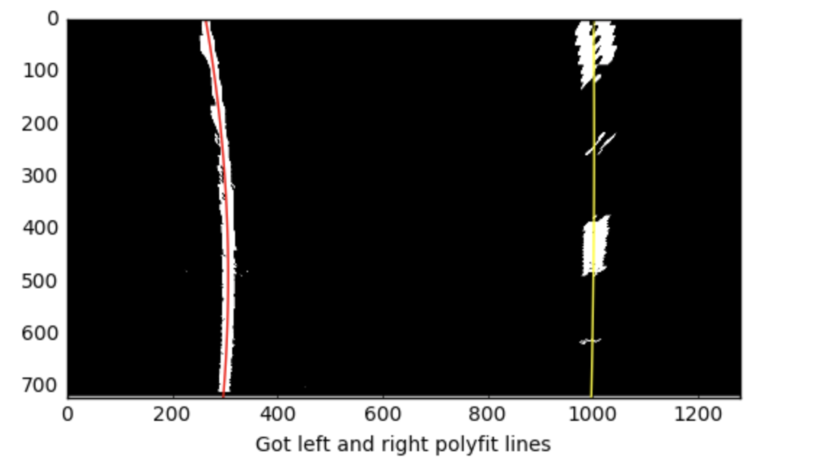
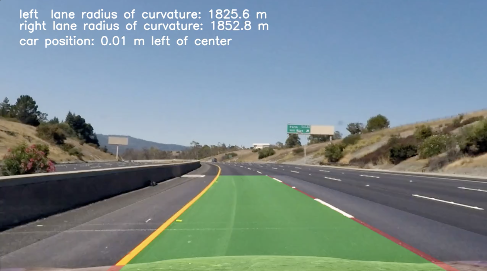

##Advanced Lane Finding Project##

The goals / steps of this project are the following:

* Compute the camera calibration matrix and distortion coefficients given a set of chessboard images.
* Apply a distortion correction to raw images.
* Use color transforms, gradients, etc., to create a thresholded binary image.
* Apply a perspective transform to rectify binary image ("birds-eye view").
* Detect lane pixels and fit to find the lane boundary.
* Determine the curvature of the lane and vehicle position with respect to center.
* Warp the detected lane boundaries back onto the original image.
* Output visual display of the lane boundaries and numerical estimation of lane curvature and vehicle position.

 
###Camera Calibration

I start by preparing "object points", which will be the (x, y, z) coordinates of the chessboard corners in the world. Here I am assuming the chessboard is fixed on the (x, y) plane at z=0, such that the object points are the same for each calibration image.  Thus, `objp` is just a replicated array of coordinates, and `objpoints` will be appended with a copy of it every time I successfully detect all chessboard corners in a test image.  `imgpoints` will be appended with the (x, y) pixel position of each of the corners in the image plane with each successful chessboard detection.  

I then used the output `objpoints` and `imgpoints` to compute the camera calibration and distortion coefficients using the `cv2.calibrateCamera()` function.  I applied this distortion correction to the test image using the `cv2.undistort()` function and obtained this result: 



### Pipeline (single images)

####1. Undistort image
I uses the function `cv2.undistort(origin_img, MTX, DIST, None, MTX)`
to undistort the original image.


####2. Generate edges binary image
 
I used a combination of color, gradient_x and gradient_y thresholds to generate a binary image (please see In[3] in project4.ipynb). Below is the result. 



####3. Perspective transform image
**I. Get perspective points**

The function `get_perspective_points()` (please see In[6] in project4.ipynb) is to get four corners in the image to define a rectangle



**II. Get prspective transform matrix**  
  
I use `cv2.getPerspectiveTransform()` to generate the transform matrix M which will be used for cv2.warpPerspective() to warp the image to a top-down view. (please see the function `get_perspective_transform()` in In[9])
    
**III. Prspective transform**  

Use `cv2.warpPerspective()` to warp the image to a top-down view. (please see In[10])  



####4. Find base points of right line and left line

I used histogram data of the warped eddes binary image. 
Please see In[11] in project4.ipynb. 
 
```python
from scipy.signal import find_peaks_cwt
# function to get the left lane and right lane base points by using histogram
# http://stackoverflow.com/questions/25571260/scipy-signal-find-peaks-cwt-not-finding-the-peaks-accurately
def find_base_points(warped_edges_img):
    """
    Return [left_base_point, right_base_point] and histogram data
    :warped_edges_img: warped edges binary image
    """ 
    height, width = warped_edges_img.shape[0:2]
    # only search the half bottom of the image
    histogram = np.sum(warped_edges_img[int(height/2):, :], axis=0)
    peak_width = [50]
    min_num_peak_pt = 20
    # indices of peak points
    idx = find_peaks_cwt(histogram, peak_width, max_distances=peak_width) 
    if len(idx) < 2:
        return None
    # drop the points from the image border (width*0.15)
    idx = [i for i in idx if i > width*0.15 and i < width*0.85
            and max(histogram[i-50: i+50]) > min_num_peak_pt]        
 
    return [min(idx), max(idx)], histogram
```

  


####5. Find points on the line  
After getting the base points I used sliding windows to search the line points on the warped edges binary image and calculate polynomial fit for left and right lines. (please check In[13] in project4.ipynb `find_lanes_points()`).   

Below is the ployfit line I got from the feature `find_lanes_points()`
  


####6. Calculated the radius of curvature of the lane and the position of the vehicle with respect to center.   

The function to calculate the radius of curvature is in `class Line()` (please see In[20]) 
  
  
```python
#calculate the rad of curvature
    def get_real_curve_rad(self, curv_fit):
        ym_per_pix = 30/720 # meters per pixel in y dimension
        xm_per_pix = 3.7/700 # meters per pixel in x dimension
        current_fitx = curv_fit[0]*self.fixed_yvals**2 + curv_fit[1]*self.fixed_yvals + curv_fit[2]
        # Fit new polynomials to x,y in world space
        real_curv_fit = np.polyfit(ym_per_pix*self.fixed_yvals, xm_per_pix*current_fitx, 2)
        # Calculate the new rad of curvature
        curverad = ((1 + (2*real_curv_fit[0]*self.y_eval + real_curv_fit[1])**2)**1.5) / np.absolute(2*real_curv_fit[0])
        #print(curverad)
        return curverad, current_fitx 
```  

And the feature to calculate vehicle position is in `process_image` (In[21])   

```python
    # calculate the car position
    xm_per_pix = 3.7/700 # meters per pixel in x dimension
    middle = (left_line.recent_fitx[-1] + right_line.recent_fitx[-1])//2
    img_mid = img_width//2
    position = (img_mid - middle)*xm_per_pix # Positive if on right, Negative on left
```


####7. Provide an example image of your result plotted back down onto the road such that the lane area is identified clearly.

I implemented a feature called `gen_final_output()` (In[16]) to combine the line image and warp undistort image. Then warp the combine image from top-down view to the original view.


  

---

###Pipeline (video)

Here's a [link to my video result](./project_video_draw_lines.mp4)

---

###Discussion

I spent lots of time finding a better way in color and gradient threshold image process. From the video you will note that the line is still not drawn that accurately and shakes a little bit when the car ran through the bridge. Reducing the noise from the edges binary image might be helpful.
And using a queue to store the line x,y values from last few confident line detection and calculate the average polyfit to smooth the drawing of the line.
 

